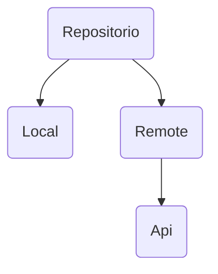

# Conexion a API    
## Patron Repositorio

## LocalDataSource
```kotlin
class PokemonLocalDataSource @Inject constructor():
PokemonDataSource(
    override suspend fun readAll(): Pokemon?{
        return datasource.readAll()
    }
    override suspend fun readOne(id:long): Pokemon?{
        return datasource.readOne()
    }
)
```
### Implementacion
```kotlin
class PokemonRepositoryImpl @Inject constructor(
    @RemoteDataSource private val remoteDataSource
    @LocalDataSource private val localDataSource
):PokemonRepository { 
    override suspend fun readAll(): Pokemon?{
        return datasource.readAll()
    }
    override suspend fun readOne(id:long): Pokemon?{
        return datasource.readOne()
    }
}

```
### Interfaz
```kotlin
interface PokemonDataSource{
    fun observe(): Flow<List<Pokemon>>
    suspend fun readAll():List<Pokemon>
    suspend fun readOne(id:Long):List<Pokemon>
}
```
## RemoteDataSource
### ReadAll
```kotlin
override suspend fun readAll(): List<Pokemon> {
    val response = api.readAll()
    val finalList = mutableListOf<Pokemon>
    return if (response.isSuccesful){
        val body = response.body()
        for(result in body.results){
            val remotePokemon = readOne(result.name)
            remotepokemon?.let{
                finalList.add(it)
            }
        }
        finalList
    }
    else{
        ListOf<Pokemon>()
    }
}
```