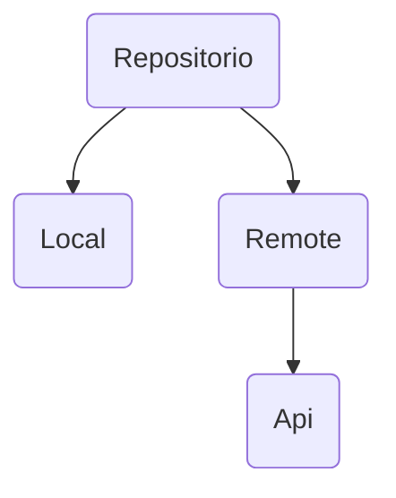

# Conexion a API    
## Patron Repositorio

## LocalDataSource
```kotlin
class PokemonLocalDataSource @Inject constructor():
PokemonDataSource(
    override suspend fun readAll(): Pokemon?{
        return datasource.readAll()
    }
    override suspend fun readOne(id:long): Pokemon?{
        return datasource.readOne()
    }
)
```