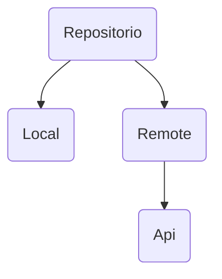

# Conexion a API    
## Patron Repositorio

## LocalDataSource
```kotlin
class PokemonLocalDataSource @Inject constructor():
PokemonDataSource(
    private val _pokemon: MutableList<Pokemon> = mutableListOf()
    private val _pokemonFlow: Flow<List<Pokemon>> = MutableSharedFlow<List<Pokemon>>
    override suspend fun observe(): Flow<List<Pokemon>>{
        _pokemon.addAll(pokemonList)
        _pokemonFlow.emit(_pokemon.toList)
    }
    override suspend fun readAll(): Pokemon?{
        return _pokemon
    }
    override suspend fun readOne(id:long): Pokemon?{
        return _pokemon.firstOrNull {
            pokemon -> pokemon.id == id
        }
    }
    private suspend fun refresh(){
        val remotePokemon = remoteDataSource.readAll()
        localDataSource.addAll(remotePokemon)
    }
)
```
### Implementacion
```kotlin
class PokemonRepositoryImpl @Inject constructor(
    @RemoteDataSource private val remoteDataSource
    @LocalDataSource private val localDataSource
):PokemonRepository { 
    override suspend fun readAll(): Pokemon?{
        return datasource.readAll()
    }
    override suspend fun readOne(id:long): Pokemon?{
        return datasource.readOne()
    }
}

```
### Interfaz
```kotlin
interface PokemonDataSource{
    fun observe(): Flow<List<Pokemon>>
    suspend fun readAll():List<Pokemon>
    suspend fun readOne(id:Long):List<Pokemon>
}
```
## RemoteDataSource
### ReadAll
```kotlin
override suspend fun readAll(): List<Pokemon> {
    val response = api.readAll()
    val finalList = mutableListOf<Pokemon>
    return if (response.isSuccesful){
        val body = response.body()
        for(result in body.results){
            val remotePokemon = readOne(result.name)
            remotepokemon?.let{
                finalList.add(it)
            }
        }
        finalList
    }
    else{
        ListOf<Pokemon>()
    }
}
```
### Observe
```kotlin
override fun observe(): Flow<List<Pokemon>> {
    return flow {
        emit(listOf<Pokemon>())
        emit(readAll())
    }.shareIn(
        scope = scope
        started = SharingStarted.WhileSubscribed(5_000L)
        replay = 1
    )
}
```
## Repositorio
### Interfaz
```kotlin
interface PokemonRepository{
    suspend fun readOne(id:Long): Pokemon?
    suspend fun readAll():List<Pokemon>
    fun observe():Flow<List<Pokemon>>
}
```
### Implementacion
```kotlin
class PokemonRepositoryImpl @Inject constructor(
    @RemoteDataSource private val remoteDataSource
    @LocalDataSource private val LocalDataSource
):
    override suspend fun readOne(id: Long): Pokemon? {
        return remoteDataSource
    }
    override suspend fun readAll(): List<Pokemon>{
        return remoteDataSource.readAll()
    }
    override fun observe(): Flow<List<Pokemon>>{
        scope.launch{
            refresh()
        }
        return localDataSource.observe()
    }
    private suspend fun refresh(){
        TODO("No hecho")
    }
```